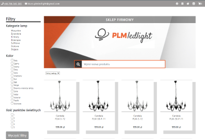

# CV

Icons made by <a href="https://www.flaticon.com/authors/pixel-perfect" title="Pixel perfect">Pixel perfect</a> from <a href="https://www.flaticon.com/" title="Flaticon">www.flaticon.com</a>

Icons made by <a href="https://www.flaticon.com/authors/pixel-perfect" title="Pixel perfect">Pixel perfect</a> from <a href="https://www.flaticon.com/" title="Flaticon">www.flaticon.com</a>

Icons made by <a href="https://www.freepik.com" title="Freepik">Freepik</a> from <a href="https://www.flaticon.com/" title="Flaticon">www.flaticon.com</a>

Icons made by <a href="https://www.freepik.com" title="Freepik">Freepik</a> from <a href="https://www.flaticon.com/" title="Flaticon">www.flaticon.com</a>

Icons made by <a href="https://www.freepik.com" title="Freepik">Freepik</a> from <a href="https://www.flaticon.com/" title="Flaticon">www.flaticon.com</a>

Icons made by <a href="https://www.freepik.com" title="Freepik">Freepik</a> from <a href="https://www.flaticon.com/" title="Flaticon">www.flaticon.com</a>

Icons made by <a href="https://www.flaticon.com/authors/riajulislam" title="riajulislam">riajulislam</a> from <a href="https://www.flaticon.com/" title="Flaticon">www.flaticon.com</a>

Icons made by <a href="https://www.flaticon.com/authors/google" title="Google">Google</a> from <a href="https://www.flaticon.com/" title="Flaticon">www.flaticon.com</a>

kod = "Photo by Christina Morillo from Pexels">

Icons made by <a href="https://www.flaticon.com/authors/th-studio" title="th studio">th studio</a> from <a href="https://www.flaticon.com/" title="Flaticon">www.flaticon.com</a>

Icons made by <a href="https://www.flaticon.com/authors/smashicons" title="Smashicons">Smashicons</a> from <a href="https://www.flaticon.com/" title="Flaticon">www.flaticon.com</a>

Icons made by <a href="https://www.freepik.com" title="Freepik">Freepik</a> from <a
                        href="https://www.flaticon.com/" title="Flaticon">www.flaticon.com</a>

                
Icons made by <a href="https://www.flaticon.com/authors/pixel-perfect" title="Pixel perfect">Pixel
                        perfect</a> from <a href="https://www.flaticon.com/" title="Flaticon">www.flaticon.com</a>

                        

        <nav class="navUp">
           

        </nav>
        <header>
            <button>My projects </button>
            <a href="#about-me"><i class="fas fa-chevron-down"></i></a>
        </header>
        <nav class="nav-menu">
            

                <i class="fas fa-bars"></i>
                <ul>
                    <li><a class='nav0' href="#">Home</a></li>
                    <li><a class='nav1' href="#">Abbout me</a></li>
                    <li><a class='nav2' href="#">Projects </a></li>
                    <li><a class='nav3' href="#">Skills</a></li>
                    <li><a class='nav4' href="#">Experiences</a></li>

                    <li><a class='nav5' href="#">Contact</a></li>
                </ul>
            

        </nav>
        <main>
            

            <section data-section="nav1" class="about-me">
                <a name="about-me">
                    <h1>About me</h1>
                </a>
                <article>
                    
 

                    

                        
 My name is Natalia Sośnierz and I would like to become Front-End Developer.
                            I am a graduate of Adam Mickiewicz University in
                            Poznań in Medical Physics.   I am a person who has always loved science,
                            solving puzzles and searching for non-tipical solutions. My friend instilled
                            programming in me
                            4 years ago. It was just a hobby back then, but it evolved into something more and I
                            decided to develop in this
                            field.   At the moment, most of my attention is focused on learning
                            new technologies, such as JavaScript, jQuery, React, hoping that will allow me to
                            work as a Junior Front-End
                            Developer. 

                        
My soft skills: 

                        <ul>
                            <li> organized </li>
                            <li> creative </li>
                            <li> ambitious </li>
                            <li> persistent </li>
                            <li> communicative </li>
                        </ul>
                    

                </article>
            </section>
            

            <section data-section="nav2" class="projects">
                <h1>Projekty</h1>
                <article class="projects-contains">
                    

                        

                            
                        

                        

                            <h2>Halloween</h2>
                            
The first website I made 3 years ago. The website is about the holiday of the dead commonly known as Halloween.

                            
Technologies

                            <ul>
                                <li>HTML</li>
                                <li>CSS</li>
                                <li>JS</li>

                            </ul>
                        

                    

                    

                        

                            
                        

                        

                            <h2>E-comm shop</h2>
                            
One of my largest projects - online store.

                            
Technologies

                            <ul>
                                <li>HTML</li>
                                <li>CSS</li>
                                <li>JS</li>
                            </ul>
                            
There is also a second version of this page in my repository using node.js. This version will be finalized after getting to know node.js better.

                        

                    

                    

                        

                            
                        

                        

                            <h2>About me</h2>
                            
Portfolio page. To create this website, I used different technologies than before.

                            
Technologies

                            <ul>
                                <li>HTML</li>
                                <li>SCSS</li>
                                <li>jQuery</li>
                            </ul>
                        

                    

                </article>
            </section>
            

            <section data-section="nav3" class="skills">
                <h1>Technical skills</h1>
                <ul>
                    <li> </li>
                    <li> </li>
                    <li></li>
                    <li> </li>
                    <li> </li>
                    <li> </li>
                    <li></li>
                </ul>
            </section>
            

            <section data-section="nav4" class="experiences">
                <h1>Experiences</h1>
                

                    <article class="experience shrink">

                        <h2>Public Tender Manager</h2>
                        <h3>Grupa Medikol (Medikol Systems Sp. z o.o., Medikol Solution Sp. z o.o.)
                             11.03.2019 -
                            31.12.2021
                        </h3>

                        

                            

                                <ul>
                                    <li>managing activities related to the comprehensive preparation and conduct of offers in public tender procedures in terms of compliance with the provisions of public tender law, public tender plan, applicable internal regulations and guidelines for awarding contracts,</li>
                                   <li>Analysis of  competitive activities another companies</li>
                                    <li>providing sales support, i.e. substantive support, development
                                        essential
                                        materials and
                                        training
                                        developing and conducting a pricing policy for post-warranty service
                                        medical equipment, public trnder, public tender plan, in force
                                        regulations
                                        internal
                                       </li>
                                   
                                    <li>preparation of documentation for submitting appeals to The Public Procurement Law  and
                                        cooperation with advocates in the field of public tender,</li>
                                    <li>keeping reports and statistics on tender procedures</li>
                                    <li>creating financial analyzes of the post-warranty service market
                                        medical equipment,
                                    </li>
                                    <li> constant cooperation with sales directors regarding the post-warranty market of medical equipment service.</li>
                                </ul>

                            

                        

                    </article>
                    <article class="experience shrink">

                        <h2>Specjalista ds. zamówień publicznych</h2>
                        <h3>Meditech Sp. z o.o. 
                            10.2016 - 03.2020</h3>

                        

                            

                                <ul>
                                    <li>przygotowywanie ofert przetargowych w zakresieformalno-merytorycznym,
                                    </li>
                                    <li>monitorowanie przebiegu postępowań przetargowych,</li>
                                    <li>przygotowywanie ofert handlowych,</li>
                                    <li>prowadzenie korespondencji z Urzędem Rejestracji Wyrobów Medycznych
                                        (URWM)
                                        oraz
                                        monitorowaniezaawansowania prowadzonych spraw.</li>
                                </ul>

                            

                        

                    </article>
                    <article class="experience shrink">
                        <h2>Specjalista ds. testów kontroli jakości</h2>
                        <h3>Meditech Sp. z o.o. 
                            06.2015 – 10.2016</h3>
                        

                            

                                <ul>
                                    <li>bieżący kontakt z klientem w sprawach handlowych dotyczących testów
                                        specjalistycznych
                                        aparatury
                                        medycznej</li>
                                    <li>wystawienie bieżących faktur za usługę</li>
                                    <li>wykonywanie testów specjalistycznych i podstawowych aparatów RTG oraz
                                        tomografów
                                        komputerowych a
                                        następnie sprawozdań z pomiarów</li>
                                    <li>prowadzenie grafiku wyjazdów działu laboratoryjnego</li>
                                    <li>przygotowywanie ofert handlowych oraz postępowań przetargowych</li>
                                    <li>prowadzenie spraw związanych z zagadnieniami PR i marketingiem firmy
                                    </li>
                                </ul>

                            

                        

                    </article>
                

            </section>
            

            <section data-section="nav5" class="contact">
                <h1>Please don't hesitate to contact with me</h1>
                

                    <form>
                        <input type="text" placeholder="Twoje imię">
                        <input type="text" placeholder="Email">
                        <textarea placeholder="Twoja wiadomość"></textarea>
                        <button>Send</button>
                    </form>
                    

                        
<a
                                href="mailto:sosnierz.natalia@gmail.com">sosnierz.natalia@gmail.com</a>

                        

                            <a href="tel:+48 533 825 308">+48 533 825
                                308</a>
                        

                        
<a
                                href="https://github.com/sosnierz/sosnierz">sosnierz</a>
                        

                        
<a
                                href="https://www.linkedin.com/in/natalia-so%C5%9Bnierz-88936222a/">natalia.sośnierz</a>
                        

                    

            </section>
            

        </main>
        <footer>
            

                
&copy; 2021 

            

        </footer>